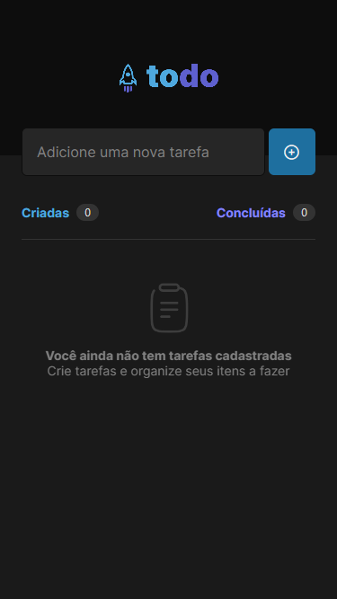
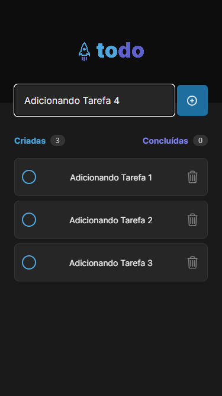
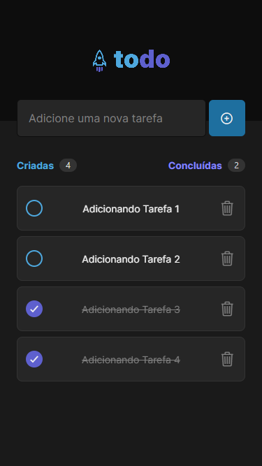

# ToDo App - Challenge 1 | Rocketseat :rocket:

First challenge of the Rocketseat Ignite Course.

### :hammer_and_wrench: Tools:

- Expo
- React-Native
- Typescript

### :white_check_mark: What you can do:

- Create a task
- Delete a task
- Mark a task as done

### :iphone: Screenshots

